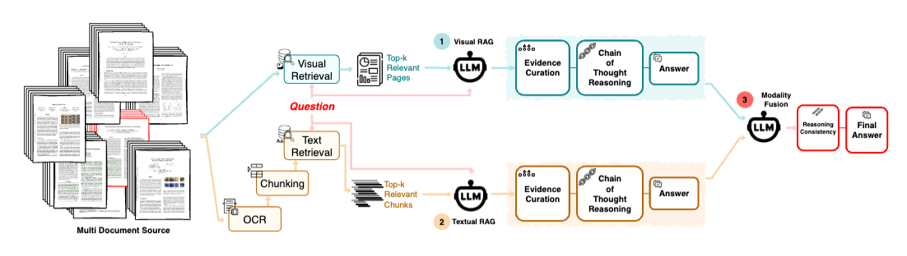

# Multimodal-RAG-for-Chat-App

## Table of contents

## Project Organization

```tree
├── src
│   ├── context_retrieval.py
│   ├── embeddings.py
│   ├── indexing.py
│   ├── parse.py
│   ├── prompts.py
│   ├── rag.py
│   ├── responses.py
│   └── utils.py
├── chat_ui.py
├── eval.py
└── test.py
```

## Dataset  

Below are **5 data splits** in **VisDoMBench** from paper [**VisDoM**: Multi-Document QA with Visually Rich Elements Using **Multimodal Retrieval-Augmented Generation**](https://arxiv.org/abs/2412.10704), a cutting-edge **multi-document, multimodal QA benchmark** designed for answering questions across **visually rich** document content

| **Dataset**     | **Domain**             | **Content Type**             | **Queries** | **Docs** | **Avg. Question Length** | **Avg. Doc Length (Pages)** | **Avg. Docs per Query** | **Avg. Pages per Query** |
|----------------|-----------------------|-----------------------------|------------|---------|----------------------|----------------------|------------------|------------------|
| **PaperTab**   | Wikipedia             | Tables, Text                | 377        | 297     | 29.44 ± 6.3          | 10.55 ± 6.3          | 10.82 ± 4.4       | 113.10 ± 50.4    |
| **FetaTab**    | Scientific Papers     | Tables                      | 350        | 300     | 12.96 ± 4.1          | 15.77 ± 23.9         | 7.77 ± 3.1        | 124.33 ± 83.0    |
| **SciGraphQA** | Scientific Papers     | Charts                      | 407        | 319     | 18.05 ± 1.9          | 22.75 ± 29.1         | 5.91 ± 2.0        | 129.71 ± 81.7    |
| **SPIQA**      | Scientific Papers     | Tables, Charts              | 586        | 117     | 16.06 ± 6.6          | 14.03 ± 7.9          | 9.51 ± 3.5        | 135.58 ± 55.2    |
| **SlideVQA**   | Presentation Decks    | Slides                      | 551        | 244     | 22.39 ± 7.8          | 20.00 ± 0.0          | 6.99 ± 2.0        | 139.71 ± 40.6    |
| **VisDoMBench** | Combined              | Tables, Charts, Slides, Text | 2271       | 1277    | 19.11 ± 5.4          | 16.43 ± 14.5         | 8.36 ± 3.0        | 128.69 ± 62.7    |

📌 *Table: Summary of data splits included in VisDoMBench.*  

## RAG components

A multimodal retrieval-augmented pipeline specifically designed for visual document understanding and question answering.



**1. Visual Retrieval:** Using models like [ColQwen2](https://huggingface.co/vidore/colqwen2-v1.0) for image-to-image and text-to-image retrieval

**2. Text Retrieval:** Using hybrid retrieval (BM25 and [BGE](https://huggingface.co/BAAI/bge-base-en-v1.5) embedding)

**3. Vision Language Model:** Using quantized [Qwen2.5-VL-7B-Instruct](https://huggingface.co/unsloth/Qwen2.5-VL-7B-Instruct-GGUF) model 

**4. Multi-Stage Pipeline:**
- Document caching and preprocessing
- Visual and textual index building
- Context retrieval based on queries
- Response generation from each modality
- Response combination for final answers

## Chat App UI


